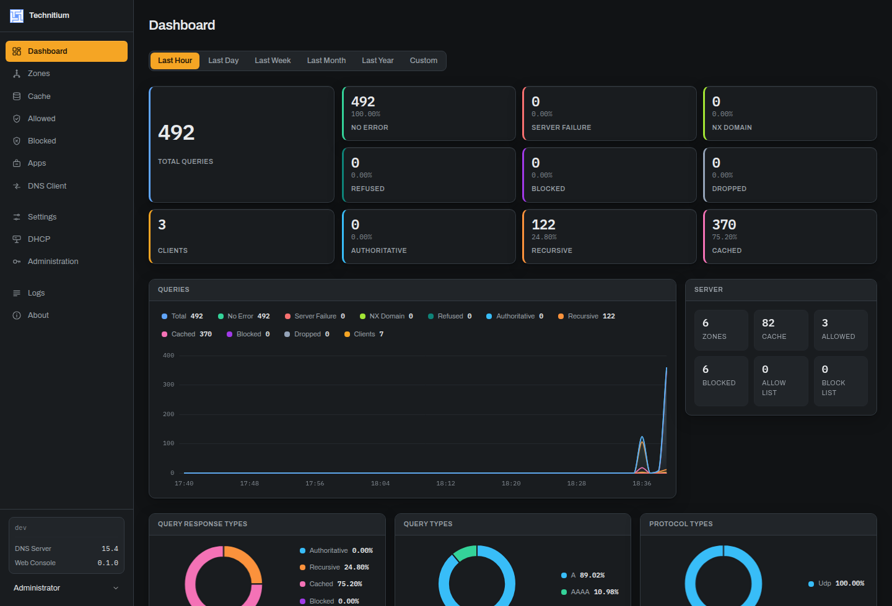
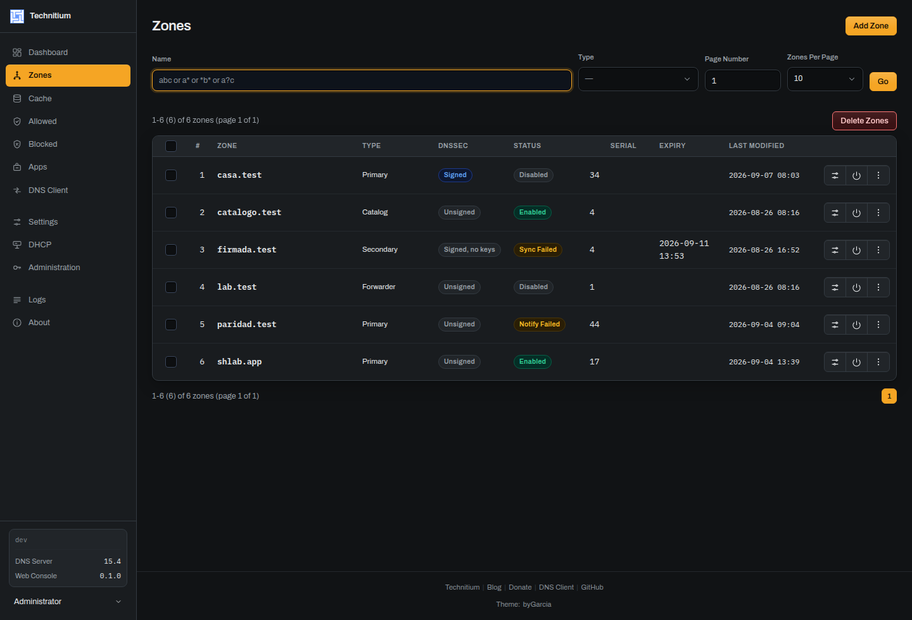
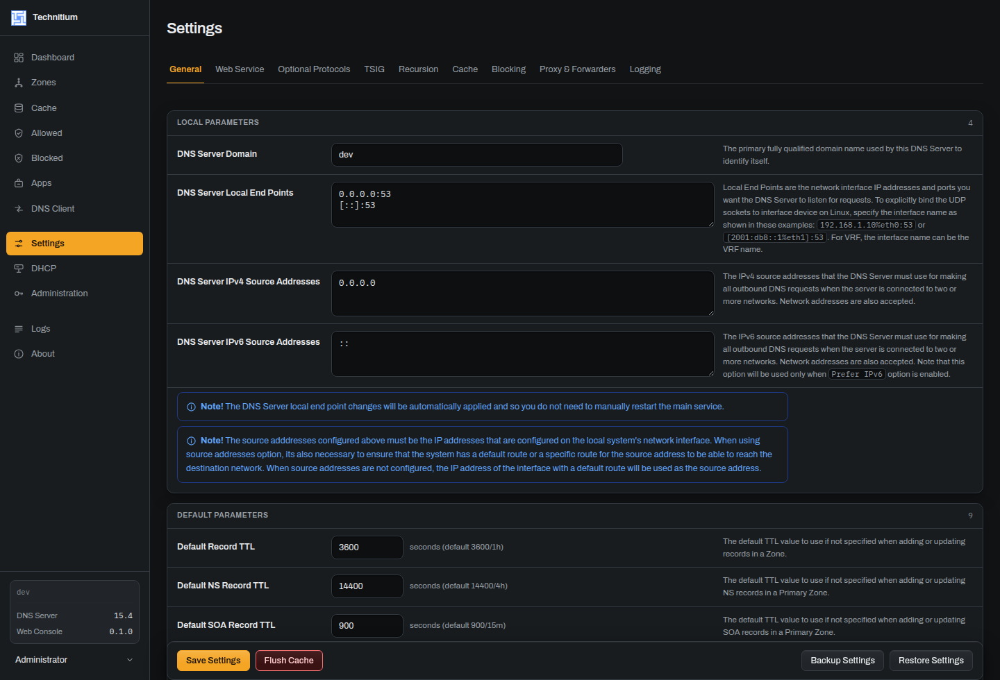
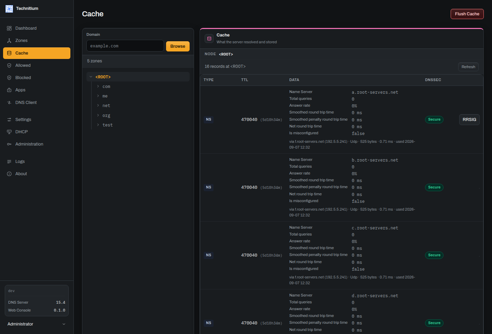
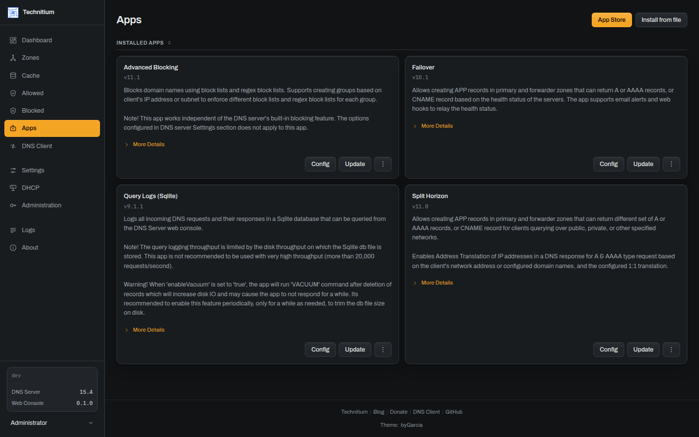
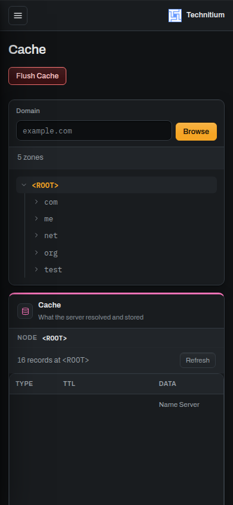

<div align="center">

# technitium-console

**An alternative administration console for [Technitium DNS Server](https://github.com/TechnitiumSoftware/DnsServer).**
Same API, same behaviour, same texts — the interface rebuilt from scratch.

[](LICENSE)
[](https://github.com/byGarcia/technitium-console/releases)
[](https://github.com/byGarcia/technitium-console/stargazers)
[](https://github.com/byGarcia/technitium-console/issues)
[](https://github.com/byGarcia/technitium-console/commits)

</div>



It replaces the console the server ships with. Install it and the DNS service
behaves exactly as before; remove it and you are back to the original. Nothing on
the server side changes: this console talks to it only through its documented
`/api` endpoints.

## Design only. Zero functionality.

That is the rule the whole project is built on, and it is worth stating plainly
because it is unusual:

> Any behavioural difference from the upstream console is a bug, **even when it
> looks like an improvement**.

Same controls, same steps, same wording, same validation order. If a feature was
missing before, it is still missing. If a confirmation asked twice, it still asks
twice. You are changing how the console looks, not what your DNS server does —
and that is the only reason it is safe to put a third-party interface in front of
infrastructure.

## What it looks like

| Zones | Settings |
|---|---|
|  |  |

| Cache, Allowed and Blocked | Apps |
|---|---|
|  |  |

The three list screens share one component and used to be indistinguishable. The tree is the object
you came to look at, so it is a column and not a box; the path says where you are; and the colour on
the records panel is the one that already means *cached* and *blocked* in the Dashboard chart and in
the Logs rows.



**It works on a phone.** The stock console overflows horizontally on a 390 px
screen in twelve of its sections. This one does not overflow in any: the tables
reflow, the navigation collapses, and the actions stay reachable. That was not a
side effect — it was a defect found by measuring every section at 390 px and
fixed one by one.

<br clear="right">

## How thoroughly

| | |
|---|---|
| Sections | 12 |
| Routes, each a real URL | 32 |
| API endpoints the stock console calls, and this one calls too | 114 of 114 |
| Sortable columns kept | 64 of 66, and the two missing are declared |
| Dialogs, checked one by one | 43 |
| Tests | 1,121 |

Parity is not asserted, it is measured. `dev/` brings up **two instances of the
official Technitium image side by side** — one serving this console, one
untouched — and the scripts in there compare them: the controls present on each
screen, the state the server is left in after fourteen real actions, the widths
at which something overflows, the CSS classes nobody uses.

```bash
cd dev && docker compose up -d     # this console on :5380, the stock one on :5381
```

## Installing

One command, on the machine where the DNS server runs:

```sh
curl -sSL https://raw.githubusercontent.com/byGarcia/technitium-console/main/install.sh | sudo sh
```

It asks the running server where its web root is, saves the console you have
now, and puts this one in its place. **Your DNS service is not restarted** — the
server picks the new files up by itself, and a restart would be an outage for
everything that resolves through it. To go back at any point:

```sh
curl -sSL https://raw.githubusercontent.com/byGarcia/technitium-console/main/install.sh | sudo sh -s -- --uninstall
```

The original console is restored from the copy the installer kept. Nothing is
downloaded to undo it.

**It works with whichever install you have**, because it does not guess: the
running server is found by what it executes, and its web root is read off the
command line that started it. Wherever you put it, that is where the console
goes.

**Your custom lists are kept**, on the way in and on the way out. Any
`json/*-custom.json` you wrote by hand is left exactly where it is — including
one you write months after installing, which no backup could contain.

**Nothing else on the server is touched.** Configuration, zones, users, logs and
`/etc/resolv.conf` come out of an install and an uninstall byte for byte the
same. The installer writes to three places and no others: the web root, its
backup, and its own state in `/var/lib/technitium-console`.

**An interrupted run cannot leave you without a console.** Files go in before
any are taken out, and every page is published after the assets it names, so at
every moment the server has a whole console to serve — the old one or the new
one. Anything a killed run left behind is cleaned up by the next one.

<details>
<summary>Running in Docker, or want to install by hand</summary>

The server's web root lives inside the container, so it has to be mounted in
from outside. Install to a folder on the host:

```sh
sudo sh install.sh --dir /opt/technitium-console
```

and mount it over the container's web root:

```yaml
    volumes:
      - /opt/technitium-console:/opt/technitium/dns/www:ro
```

Other options: `--version <tag>` to pin a release, `--from <path>` to install
from a tarball you already downloaded, `--dir <path>` to say where the web root
is, `--url <base>` if your web console does not answer on
`http://127.0.0.1:5380`, `--yes` to skip the confirmation.

If the backup was taken from a different version of the DNS server than the one
now running — which happens when the server was updated in between — the
uninstall stops and says so rather than putting an old console in front of a new
server. `--restore-mismatched-backup` overrides that, and `--yes` deliberately
does not.

**Linux only.** Windows installs are laid out differently and have their own
installer; this script does not try to handle them.

</details>

> **After a server update.** Technitium restores its own console when it
> updates, so run the installer again afterwards. This goes away once the server
> can be told to serve the console from a folder of its own — the change is
> written and the maintainer has agreed to merge it.

## Building

```bash
npm install
npm run build        # emits into dist/
npm run dev          # Vite development server
npm test             # 1,121 tests
npm run typecheck
npm run lint
```

React 19.2, TypeScript 6.0, Vite 8.2. **npm**, not pnpm or yarn, so building this
needs nothing installed beyond Node.

Before changing anything, read [CONVENTIONS.md](CONVENTIONS.md). It holds the rule
above, the upstream behaviours discovered along the way, and four constraints the
server imposes that will let you break production while development looks fine.

[PRODUCT.md](PRODUCT.md) says what this owns and what it refuses to become,
[CONTRIBUTING.md](CONTRIBUTING.md) how to run the two-instance harness, and
[AGENTS.md](AGENTS.md) is the short version for whoever arrives next.

## Status

Feature-complete against Technitium DNS Server v15.4 and verified against it. Not
merged upstream: the maintainer
[closed the pull request](https://github.com/TechnitiumSoftware/DnsServer/pull/2128)
because he is not a frontend developer and could not maintain the stack through
future releases, and suggested shipping it as an installable alternative console
instead. This repository is that.

## Licence

GPL-3.0-or-later, the same licence as Technitium DNS Server, whose console this
replaces. See [LICENSE](LICENSE).

This is an independent project, not affiliated with or endorsed by Technitium.
The Technitium name and logo belong to Technitium and are used here only to
identify the software this console is built for.
